# Mapa Entidad-Relación · Base de Datos Supabase Volvix POS

**Generado:** 2026-05-22
**Total tablas en Supabase:** 408
**Schema:** PostgreSQL via Supabase (REST: `/rest/v1/`)
**Project ref:** `zhvwmzkcqngcaqpdxtwr`

---

## 1. Resumen por dominios funcionales

| Dominio | # tablas | Tablas principales |
|---------|----------|--------------------|
| **POS Multi-tenant** | 69 | `pos_companies`, `pos_users`, `pos_products`, `pos_sales`, `pos_customers` |
| **CFDI/SAT (Facturación)** | 18 | `cfdi_invoices`, `cfdi_documents`, `cfdi_folios`, `cfdi_templates` |
| **Volvix Core (SaaS)** | 17 | `volvix_tenants`, `volvix_features`, `volvix_audit_log`, `volvix_giro_searches` |
| **CRM / Clientes** | 16 | `customer_otps`, `crm_activities`, `loyalty_transactions`, `customer_segments` |
| **Inventario** | 13 | `inventory_warehouses`, `inventory_stock`, `inventory_movements`, `inventory_transfers` |
| **Giros (catálogo)** | 10 | `giros_maestro`, `giros_terminologias`, `giros_modulos`, `giros_buttons`, `giros_synonyms` |
| **Email/Drip** | 7 | `email_campaigns`, `email_templates`, `drip_subscriptions`, `newsletter_subscribers` |
| **Marketplaces** | 7 | `ml_orders`, `ml_listings`, `ml_oauth_tokens`, `amazon_orders_mirror`, `shopify_*` |
| **Seguridad** | 7 | `admin_sessions`, `mfa_attempts`, `fraud_alerts`, `admin_2fa_secrets` |
| **Caja** | 5 | `cuts`, `cuts_cash_movements`, `cash_register`, `cashier_checkins` |
| **RRHH/Citas** | 5 | `employees`, `appointments`, `appointment_blocks`, `attendance` |
| **KDS (Cocina)** | 5 | `kds_tickets`, `kds_stations`, `kitchen_orders`, `kitchen_notifications` |
| **Devoluciones** | 4 | `returns`, `return_items`, etc. |
| **Pagos** | 3 | `billing_invoices`, `customer_payments`, `payment_methods` |
| **Otros** | 199 | logs, configs, jobs, abtest, fingerprint, gift_cards, kiosk, etc. |

---

## 2. Diagrama Mermaid — Núcleo del sistema

```mermaid
erDiagram
    %% ═══════════ MULTI-TENANT CORE ═══════════
    pos_users ||--o{ pos_companies : "owner_user_id"
    pos_users ||--o{ pos_products : "pos_user_id"
    pos_users ||--o{ pos_sales : "pos_user_id"
    pos_companies ||--o{ pos_products : "tenant_id"
    pos_companies ||--o{ pos_sales : "tenant_id"
    pos_companies ||--o{ pos_customers : "tenant_id"
    pos_companies }o--|| giros_maestro : "business_type→slug"

    %% ═══════════ VENTAS ═══════════
    pos_sales ||--o{ pos_customers : "customer_id"
    pos_sales ||--o{ pos_products : "items[].product_id (jsonb)"
    pos_sales ||--o{ cfdi_invoices : "ticket_id"
    pos_sales }o--o| currencies : "currency_code"

    %% ═══════════ INVENTARIO ═══════════
    pos_products ||--o{ inventory_stock : "product_id"
    inventory_warehouses ||--o{ inventory_stock : "location_id"
    inventory_warehouses ||--o{ inventory_movements : "warehouse_id"
    pos_products ||--o{ inventory_movements : "product_id"

    %% ═══════════ CLIENTES / CRM ═══════════
    pos_customers ||--o{ customer_otps : "customer_id"
    pos_customers ||--o{ loyalty_transactions : "customer_id"
    pos_customers ||--o{ crm_activities : "customer_id"
    pos_customers ||--o{ appointments : "customer_id"

    %% ═══════════ CFDI / FACTURACIÓN ═══════════
    cfdi_invoices }o--o| cfdi_folios : "series+folio"
    cfdi_invoices ||--o{ invoice_lines : "invoice_id"

    %% ═══════════ VOLVIX SaaS ═══════════
    volvix_tenants ||--o{ volvix_features : "tenant_id"
    volvix_tenants ||--o{ volvix_audit_log : "tenant_id"
    volvix_tenants }o--|| pos_users : "owner_user_id"

    %% ═══════════ GIROS (catálogo multi-vertical) ═══════════
    giros_maestro ||--o{ giros_terminologias : "slug→giro_slug"
    giros_maestro ||--o{ giros_modulos : "slug"
    giros_maestro ||--o{ giros_buttons : "slug"
    giros_maestro ||--o{ giros_synonyms : "slug"
    giros_maestro ||--o{ volvix_giro_searches : "slug"

    %% ═══════════ CAJA ═══════════
    cuts ||--o{ cuts_cash_movements : "cut_id"
    cuts }o--o| pos_users : "cashier_user_id"
    cashier_checkins }o--|| pos_users : "user_id"

    %% ═══════════ COCINA (KDS) ═══════════
    kds_stations ||--o{ kds_tickets : "station_id"
    pos_sales ||--o{ kds_tickets : "sale_id"

    %% ═══════════ RRHH ═══════════
    employees ||--o{ attendance : "employee_id"
    employees ||--o{ appointments : "staff_id"
    employees ||--o{ employee_documents : "employee_id"

    %% ═══════════ TRACKING (público) ═══════════
    volvix_visitor_presence }o--o| giros_maestro : "giro→slug"
```



---

## 3. Tablas core — Detalle de columnas

### 🏢 `pos_companies` (Tenant / Empresa) — 21 cols
| Col | Tipo | FK |
|-----|------|-----|
| **id** (PK) | uuid | — |
| name | text | — |
| **owner_user_id** | uuid | → `pos_users.id` |
| plan | text | (trial/basic/pro/enterprise) |
| is_active | boolean | — |
| expires_at | timestamptz | — |
| business_type | text | → `giros_maestro.slug` (lógico) |
| rfc | text | — |
| city, state | text | — |
| status | text | — |
| previous_plan, plan_changed_at | — | tracking de upgrades |

### 👤 `pos_users` — 70 cols (mucho extendido por features)
| Col | Tipo | Descripción |
|-----|------|-------------|
| **id** (PK) | uuid | — |
| phone | text | login principal (México) |
| email | text | — |
| password_hash | text | — |
| role | text | owner/manager/cashier/customer |
| restaurant_id | text | legacy compat |
| is_active | boolean | — |
| plan | text | — |
| platform_signup | text | de qué giro vino |
| last_ip | text | — |

### 📦 `pos_products` — 78 cols
| Col | Tipo | FK |
|-----|------|-----|
| **id** (PK) | uuid | — |
| **pos_user_id** | uuid | → `pos_users.id` |
| code (SKU) | text | — |
| name | text | — |
| category | text | — |
| price | numeric | precio venta |
| cost | numeric | costo |
| stock | integer | — |
| **currency_code** | char(3) | → `currencies.code` |
| version | integer | optimistic locking |
| (+60 cols más para multi-image, multimedia, etc.) | | |

### 💰 `pos_sales` — 45 cols
| Col | Tipo | FK |
|-----|------|-----|
| **id** (PK) | uuid | — |
| **pos_user_id** | uuid | → `pos_users.id` |
| total | numeric | — |
| items | jsonb | array de productos vendidos |
| payment_method | text | — |
| tip_amount, tip_split | jsonb | propinas |
| fraud_review, fraud_score | bool/int | anti-fraude |
| **currency_code** | char(3) | → `currencies.code` |
| fx_rate_to_base | numeric | conversión |
| cancel_reason | text | — |

### 🏪 `pos_customers` — 67 cols (extendido por CRM)
| Col | Tipo |
|-----|------|
| **id** (PK) | uuid |
| name | text |
| email, phone, address | text |
| credit_limit, credit_balance | numeric |
| points, loyalty_points | integer |
| active | boolean |
| user_id | uuid (compat) |
| tenant_id | uuid |

### 🌎 `giros_maestro` — 13 cols (catálogo SSOT migrado en V13.31)
| Col | Tipo |
|-----|------|
| **id** (PK) | uuid |
| **slug** (UQ) | text |
| nombre | text |
| categoria | text (Comida & Bebida, Retail, Servicios, etc.) |
| emoji | text |
| sinonimos | text[] |
| landing_slug | text |
| activo | boolean |
| prioridad | integer |
| **metadata** | jsonb (terminologias_full, modules_enabled, productos_plantilla, cadena_valor, competidores_sector) |
| created_at, updated_at | timestamptz |

### 📚 `giros_terminologias` — 13 cols (mapeo giro → labels UI)
| Col | Tipo |
|-----|------|
| **id** (PK) | uuid |
| **giro_slug** | varchar |
| terminologias | jsonb (key→label) |
| modulos_activos | jsonb (array) |
| modulos_inactivos | jsonb (array) |
| campos_visibles | jsonb |
| scian_code | varchar |
| active | boolean |

### 🔥 `volvix_giro_searches` — 7 cols (tracking público)
| Col | Tipo |
|-----|------|
| **id** (PK) | bigserial |
| searched_at | timestamptz |
| **slug** | text |
| query_raw | text |
| ip_hash | text (SHA256 truncado) |
| user_agent | text |
| meta | jsonb |

### 🟢 `volvix_visitor_presence` — 6 cols (presencia en vivo)
| Col | Tipo |
|-----|------|
| **session_id** (PK) | text |
| last_seen | timestamptz |
| page | text |
| giro | text |
| ip_hash | text |
| user_agent | text |

### 🏢 `volvix_tenants` — 14 cols
| Col | Tipo |
|-----|------|
| **id** (PK) | uuid |
| nombre | text |
| tipo_negocio | text |
| email, telefono | text |
| logo_url | text |
| activo | boolean |
| plan | text |
| features_activos | jsonb |
| ai_ultimo_analisis | timestamptz |
| owner_user_id | text |

### 📄 `cfdi_invoices` — 38 cols
| Col | Tipo |
|-----|------|
| **id** (PK) | uuid |
| tenant_id | text |
| ticket_id | text (→ pos_sales.id como string) |
| customer_rfc, customer_name | text |
| series, folio | text |
| uuid_sat | text |
| total | numeric |
| facturama_id | text |
| status | text (issued/cancelled) |
| issued_at, cancelled_at | timestamptz |
| receiver_zipcode | varchar |

### 📦 `inventory_stock` — 7 cols (stock por warehouse)
| Col | Tipo | FK |
|-----|------|-----|
| tenant_id | uuid | — |
| **product_id** (PK) | uuid | → `pos_products.id` |
| **location_id** (PK) | uuid | → `inventory_warehouses.id` |
| qty | numeric | — |
| reserved_qty | numeric | — |
| reorder_point | numeric | — |

### 📅 `appointments` — 12 cols
| Col | Tipo | FK |
|-----|------|-----|
| **id** (PK) | uuid | — |
| tenant_id | uuid | — |
| customer_id | uuid | → `pos_customers.id` |
| **service_id** | uuid | → `services.id` |
| **staff_id** | uuid | → `employees.id` |
| starts_at, ends_at | timestamptz | — |
| status | text | — |

---

## 4. Patrones arquitectónicos clave

### A. Multi-tenancy
**Doble modelo** coexiste:
- `pos_companies` (legacy original, owner_user_id apunta a pos_users)
- `volvix_tenants` (modelo Volvix SaaS más nuevo, JSONB para features)
- Las tablas hijas (productos, ventas) usan `tenant_id` (uuid) para aislar

### B. Catálogo de giros (V13/V14)
**SSOT en `giros_maestro`** — 295 giros con todo en `metadata` JSONB:
- `terminologias_full` — labels UI por giro
- `modules_enabled` — qué módulos del POS activar
- `productos_plantilla` — top 10 productos pre-cargados con imágenes
- `cadena_valor` — proveedores + clientes finales
- `competidores_sector` — sistemas rivales con precios

### C. Tracking en vivo (V13.25/V13.26)
- `volvix_giro_searches` — append-only de búsquedas marketplace
- `volvix_visitor_presence` — upsert por session_id, TTL 24h via DELETE cada 5% de requests

### D. RLS (Row Level Security)
La mayoría de tablas tienen RLS habilitado con políticas:
- `service_role`: full access
- `authenticated`: por `tenant_id = auth.jwt() ->> 'tenant_id'`
- `anon`: solo SELECT en tablas marketplace públicas

### E. Currency multi-divisa
`pos_sales` y `pos_products` referencian `currencies.code` + guardan `fx_rate_to_base` para snapshot histórico del tipo de cambio.

### F. Versionado optimistic
`pos_products.version` + `pos_sales.version` integer para concurrent updates (UPDATE ... WHERE version=N → si falla, retry).

---

## 5. Datos de producción ahora mismo

```
giros_maestro:               295 rows (catálogo)
giros_terminologias:          30 rows (terminologías seedadas V13.31)
volvix_giro_searches:         40+ rows (V13.25 + tests)
volvix_visitor_presence:       1-N rows (TTL 24h, V13.26)
pos_companies (tenants):     128 rows (mostrado en stat bar)
giros con categoria:         100% (V13.35 reclasificación)
```

---

## 6. Tablas que pueden necesitar limpieza

| Tabla | Razón |
|-------|-------|
| `_backup_giros_synonyms_pre_giros1200` | Backup viejo, pre-migración |
| `_backup_vertical_templates_pre_giros1200` | Backup viejo |
| `_backup_verticals_pre_giros1200` | Backup viejo |
| `giros_synonyms_compat`, `giros_terminologias_compat` | Aliases viejos para back-compat |

Estos podrían borrarse si la migración V13/V14 está estable.

---

## 7. Endpoints REST que el panel usa

| Endpoint | Tabla | Operación |
|----------|-------|-----------|
| `/rest/v1/giros_maestro` | giros_maestro | GET (catálogo) + PATCH (seed) |
| `/rest/v1/volvix_giro_searches` | tracking | POST (track) + GET (stats) |
| `/rest/v1/volvix_visitor_presence` | presencia | POST (ping upsert) + GET (active) |
| `/rest/v1/pos_companies` | tenants | GET (count by business_type) |
| `/rest/v1/pos_sales` | ventas | POST (create), GET (history) |
| `/rest/v1/pos_products` | catálogo | CRUD |
| `/rest/v1/cfdi_invoices` | facturación | POST + GET |

---

## 8. Próximos pasos sugeridos sobre la BD

1. **Borrar las 3 tablas `_backup_*`** (~ahorra espacio)
2. **Crear índices compuestos** en `volvix_giro_searches (slug, searched_at)` para queries del statbar
3. **Configurar pg_cron** para limpieza automática de `volvix_visitor_presence` (>24h) en lugar de DELETE on-demand
4. **Migrar `pos_sales.items` (jsonb)** a tabla normalizada `pos_sale_items` para análisis más fácil
5. **Agregar columna `terminologias_full` directamente** (no en metadata JSONB) para queries más rápidas
6. **Materialized view** `mv_sales_daily` ya existe — usarla para dashboards en lugar de aggregations live

---

_Archivo generado automáticamente desde `/rest/v1/` OpenAPI spec (2.1 MB)._
_Para regenerar: `curl $SUPA_URL/rest/v1/ > .audit/supabase-openapi.json`._
