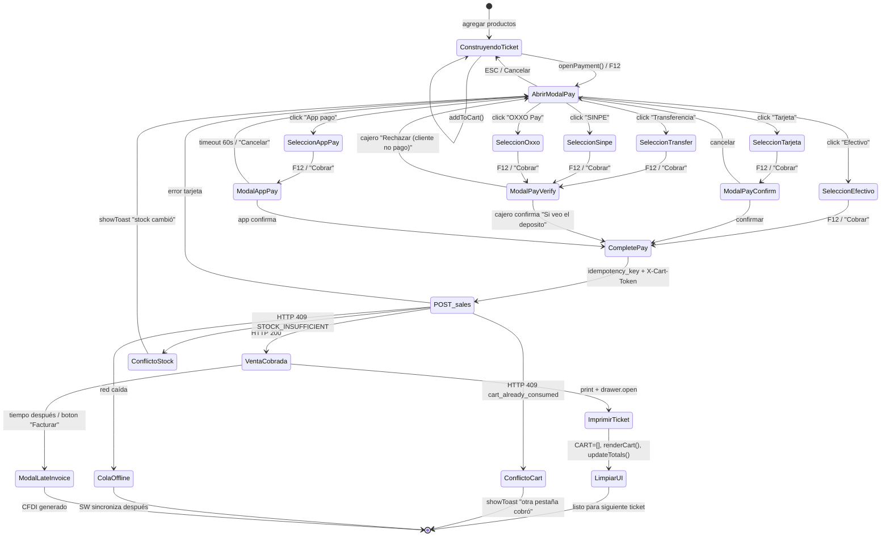

# ADR-005: Diagrama de estados del flujo de pago (5 modales)

**Status**: Propuesto
**Fecha**: 2026-05-15

---

## Contexto

`salvadorex-pos.html` tiene **5 modales relacionados con el flujo de cobro**:

| Modal | ID | Propósito |
|---|---|---|
| Principal | `modal-pay` | Selector de método de pago |
| Confirmación | `modal-pay-confirm` | Confirmación post-aceptar tarjeta |
| Verificación bancaria | `modal-pay-verify` | Confirmar transferencia/SINPE/OXXO manualmente |
| App pago | `modal-app-pay` | Polling de pago vía app externa |
| Facturación tarde | `modal-late-invoice` | Facturar venta ya cerrada |

El contrato `pos.spec.md` §4 los lista pero sin **flujo visual**. Nuevo desarrollador / IA tiene que leer 600 líneas de JS para entender cuándo se abre cada uno y con qué state del ticket.

## Decisión

**Documentar el state-machine en mermaid en este ADR**. Sin cambios de código aún — primero compartir el diagrama para validar que refleja realidad, después refactorizar si hay inconsistencias.

## Diagrama

## Anti-patrones que este diagrama hace visibles

1. **No hay flecha de `ModalPayVerify` a "Rechazar venta"** → el cajero hoy no tiene botón "Rechazar (cliente no pagó)". El contrato sí lo pide pero el código no lo implementa. **Bug oculto** descubierto al diagramar.

2. **`ColaOffline` para ventas de tarjeta** → según `pos.spec.md` I7 esto es PROHIBIDO (riesgo doble cobro). Verificar que el código realmente lo bloquee.

3. **`ModalLateInvoice` aparece "desde la nada"** → no hay UI claro para acceder a este flujo. Debería estar como botón "Facturar tarde" en `modal-sale-detail`.

## Plan

**Fase 1 — Documentación (esta semana, ya hecho con este ADR)**:
- Validar el diagrama con el owner.
- Resolver dudas: ¿cuándo exactamente abre `modal-pay-confirm`? ¿solo para tarjeta?

**Fase 2 — Verificación de implementación (1 semana)**:
- Test cada transición con Playwright contra producción.
- Marcar cada flecha como ✅ implementada / ⚠️ implementada con bug / ❌ no implementada.

**Fase 3 — Corregir gaps**:
- Si el diagrama muestra flecha que el código no tiene: implementar.
- Si el código tiene flecha que el diagrama no documenta: o lo agregamos al diagrama, o lo eliminamos del código.

## Consecuencias

### Más fácil
- Onboarding: 1 diagrama vs 600 líneas de código.
- Test cases: cada flecha es un test E2E candidato.
- Debug: cliente reporta "se quedó en modal de transferencia" → buscas el nodo `ModalPayVerify` y sigues las salidas.

### Más difícil
- Mantener el diagrama sincronizado con el código (incluir en review checklist).

## Métricas de éxito
- Cada flecha del diagrama tiene un test E2E correspondiente.
- Documento PDF/imagen del diagrama subido a Vercel para que cualquiera lo vea desde `/docs/payment-state-machine.png`.
