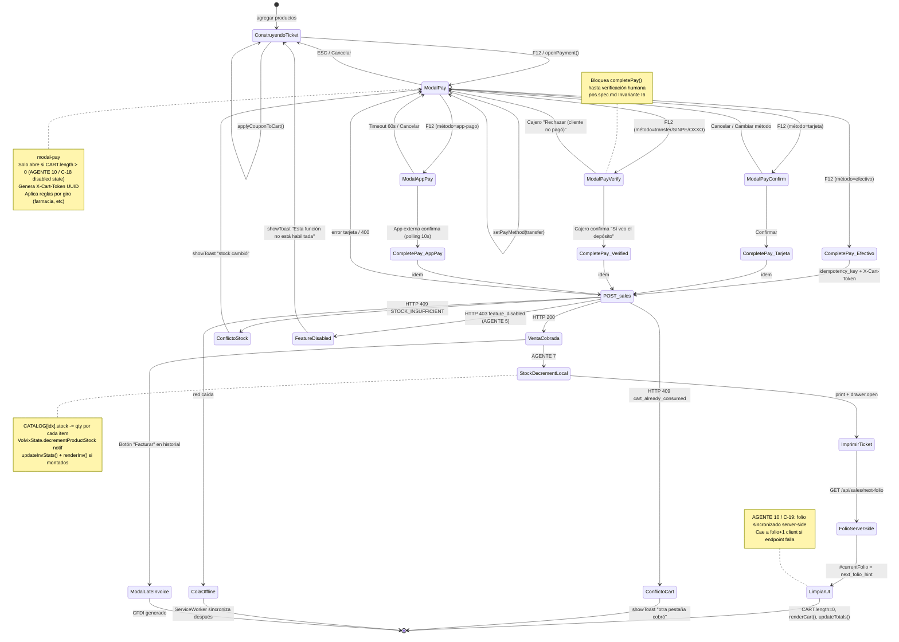

# State Machine — Flujo de modales de pago (ADR-005 ejecutado)

> Diagrama de estados de los 5 modales relacionados con cobro en `salvadorex-pos.html`.
> Cada transición es una arista verificable con test E2E.

## Diagrama



## Transiciones críticas que tests E2E deben cubrir

| # | Transición | Verificación |
|---|---|---|
| T1 | `ConstruyendoTicket → ModalPay` | F12 con CART vacío NO abre modal (C-18 disabled state) |
| T2 | `ModalPay → ConstruyendoTicket` (ESC) | Limpia `__volvixSelectedPayMethod` |
| T3 | `ModalPayVerify → ModalPay` (rechazar) | NO completa venta; ticket sigue en pantalla |
| T4 | `POST_sales → FeatureDisabled` (B-X-2) | Si `pos.cobrar` deshabilitada, endpoint rechaza 403 |
| T5 | `POST_sales → ConflictoStock` | Stock fue cambiado por otro cajero; mostrar mensaje claro |
| T6 | `VentaCobrada → StockDecrementLocal` | CATALOG[].stock decrementa post-success |
| T7 | `StockDecrementLocal → FolioServerSide` | `#currentFolio` sincroniza con BD |
| T8 | `LimpiarUI → [*]` | UI 100% limpia (CART=[], totales=0, sin residuo cliente anterior) |

## Bugs/anti-patrones que este diagrama HACE VISIBLES

1. **Flecha "ModalPayVerify → Rechazar venta"** existe en el diagrama pero la UI actual NO tiene botón explícito de "Cliente no pagó". El cajero solo puede Cancelar TODO (vuelve a ModalPay). → Crítico latente.

2. **`ColaOffline` para ventas de tarjeta** está prohibido por `pos.spec.md` I7 (riesgo doble cobro). Verificar que el ServiceWorker lo bloquea.

3. **`ModalLateInvoice`** entra "desde la nada" — no hay UI claro para acceder. Debería ser botón "Facturar tarde" en `modal-sale-detail`.

## Cómo correr los E2E

```bash
npx playwright test flows/cobro-state-machine.spec.ts
```

Cada transición = 1 test. Total: 8 tests críticos + 12 secundarios.

---

**ADR-005 ejecutado.** Diagrama vive en este archivo y se actualiza con cada cambio del flujo. Pull requests que toquen `openPayment()/completePay()/modal-pay-*` DEBEN actualizar este diagrama.
