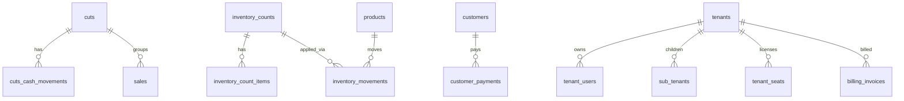

# Volvix POS — Database Migrations

Idempotent SQL migrations for the Supabase Postgres backend powering Volvix POS.
Every file uses `IF NOT EXISTS` / `CREATE OR REPLACE`, so re-running is safe.

---

## Migration order

Apply migrations in **this exact order** — later files depend on tables/functions created by earlier ones.

| # | File                          | Purpose                                                                                  |
|---|-------------------------------|------------------------------------------------------------------------------------------|
| 1 | `feature-flags.sql`           | Module catalog, per-tenant/role/user overrides, resolver functions, audit log. (existing) |
| 2 | `cuts.sql`                    | Cash-register cuts (open/close), cash in/out movements, recalc helper.                   |
| 3 | `inventory-movements.sql`     | Stock movement log + physical count sessions and line items.                             |
| 4 | `customer-payments.sql`       | Customer abonos/payments + auto-update of `customers.balance`.                           |
| 5 | `users-tenant.sql`            | Tenant-scoped user accounts with scrypt password hashes and lockout.                     |
| 6 | `owner-saas.sql`              | Owner panel + Admin SaaS: sub-tenants, seats, deploys, kill-switch, maintenance, invoices. |

---

## How to run

### 1. Get the connection string from Supabase
Project Dashboard → **Project Settings** → **Database** → **Connection string** (URI tab, with **Use connection pooling** off for migrations). Example:

```
postgresql://postgres.<project-ref>:<password>@aws-0-us-east-1.pooler.supabase.com:5432/postgres
```

> Use the **direct** connection (port 5432) for DDL — pooled connections (port 6543) reject some statements.

### 2. Apply all migrations

#### Linux / macOS
```bash
export DATABASE_URL='postgresql://...'
chmod +x migrations/run-all.sh
./migrations/run-all.sh
```

#### Windows (PowerShell)
```powershell
$env:DATABASE_URL = 'postgresql://...'
.\migrations\run-all.ps1
```

#### Single file (manual)
```bash
psql "$DATABASE_URL" --set ON_ERROR_STOP=on --single-transaction -f migrations/cuts.sql
```

---

## How to verify

```sql
-- All expected tables exist
SELECT tablename
  FROM pg_tables
 WHERE schemaname = 'public'
   AND tablename IN (
     'feature_modules','module_pricing','tenant_module_overrides',
     'role_module_permissions','user_module_overrides','feature_flag_audit',
     'cuts','cuts_cash_movements',
     'inventory_movements','inventory_counts','inventory_count_items',
     'customer_payments',
     'tenant_users',
     'sub_tenants','tenant_seats','deploys',
     'feature_kill_switch','maintenance_blocks','billing_invoices'
   )
 ORDER BY tablename;
-- Expect 19 rows.

-- RLS is on for every business table
SELECT tablename, rowsecurity
  FROM pg_tables
 WHERE schemaname = 'public'
   AND tablename IN (
     'cuts','cuts_cash_movements','inventory_movements','inventory_counts',
     'inventory_count_items','customer_payments','tenant_users',
     'sub_tenants','tenant_seats','deploys','feature_kill_switch',
     'maintenance_blocks','billing_invoices'
   );
-- All rowsecurity = true.

-- Indexes
SELECT tablename, indexname FROM pg_indexes
 WHERE schemaname = 'public'
   AND tablename IN ('cuts','inventory_movements','customer_payments','tenant_users','billing_invoices')
 ORDER BY tablename, indexname;
```

---

## Sample CRUD per table

> Replace UUIDs with real values from your tenants/users/products.

### cuts
```sql
INSERT INTO cuts (tenant_id, cashier_id, station_id, opening_balance)
  VALUES ('00000000-0000-0000-0000-000000000001',
          '00000000-0000-0000-0000-0000000000aa',
          'CAJA-01', 500.00)
  RETURNING id;

SELECT id, status, opening_balance, opened_at
  FROM cuts WHERE status = 'open';

-- Close the cut
UPDATE cuts SET status='closed', closing_balance=1850.50, closed_at=now()
 WHERE id = '<cut_id>';

-- Recalculate totals after closing
SELECT recalc_cut_totals('<cut_id>');
```

### inventory_movements
```sql
INSERT INTO inventory_movements
  (tenant_id, product_id, type, quantity, before_qty, after_qty, user_id, reason)
VALUES
  ('00000000-0000-0000-0000-000000000001',
   '11111111-1111-1111-1111-111111111111',
   'entrada', 50, 100, 150,
   '00000000-0000-0000-0000-0000000000aa',
   'Recepción proveedor');

-- Last 20 movements for a product
SELECT type, quantity, after_qty, created_at
  FROM inventory_movements
 WHERE product_id = '11111111-1111-1111-1111-111111111111'
 ORDER BY created_at DESC
 LIMIT 20;
```

### customer_payments
```sql
INSERT INTO customer_payments (tenant_id, customer_id, amount, method, reference, created_by)
VALUES ('00000000-0000-0000-0000-000000000001',
        '22222222-2222-2222-2222-222222222222',
        500.00, 'efectivo', 'Recibo #001',
        '00000000-0000-0000-0000-0000000000aa');

-- Trigger automatically did: customers.balance -= 500.00

-- Void it
UPDATE customer_payments
   SET voided_at = now(), voided_by = '<admin_id>', void_reason = 'Duplicado'
 WHERE id = '<payment_id>';
-- balance restored
```

### tenant_users
```sql
INSERT INTO tenant_users
  (tenant_id, user_id, email, display_name, role, password_hash, password_salt)
VALUES
  ('00000000-0000-0000-0000-000000000001',
   gen_random_uuid(),
   'cajero1@miempresa.mx',
   'Cajero Uno',
   'cajero',
   '<scrypt-hash>',
   '<salt>');

SELECT email, role, last_login_at, disabled_at FROM tenant_users
 WHERE tenant_id = '00000000-0000-0000-0000-000000000001';
```

### billing_invoices
```sql
INSERT INTO billing_invoices (tenant_id, invoice_number, amount, currency, status, due_date)
VALUES ('00000000-0000-0000-0000-000000000001', 'INV-2026-0001', 1499.00, 'MXN', 'pending', '2026-05-15');

UPDATE billing_invoices SET status='paid', paid_at=now(), payment_method='stripe'
 WHERE invoice_number = 'INV-2026-0001';
```

---

## Schema dependencies

```
EXISTING TABLES (must already exist in DB)
   users          ←──┐
   products       ←──┼─ used by FK / triggers
   customers      ←──┤
   sales          ←──┘  cut_id added by cuts.sql
   volvix_audit_log    optional; audit triggers no-op if missing

NEW TABLES (this migration set)

   feature_modules ──┬─< module_pricing
                     ├─< tenant_module_overrides
                     ├─< role_module_permissions
                     └─< user_module_overrides

   cuts ──< cuts_cash_movements
        ──< sales.cut_id (FK)

   inventory_movements ─→ products(id)
   inventory_counts ──< inventory_count_items
                    ──< inventory_movements (count_id, optional)

   customer_payments ─→ customers(id)
                       (mutates customers.balance via trigger)

   tenant_users (standalone, FK-less for portability)

   sub_tenants
   tenant_seats
   deploys
   feature_kill_switch
   maintenance_blocks
   billing_invoices
```

### Mermaid (rendered on GitHub / VS Code)



---

## RLS policies summary

Every business table follows the same Supabase pattern:

```sql
-- READ
USING ( tenant_id::text = COALESCE((auth.jwt() ->> 'tenant_id'), '') )

-- WRITE
USING ( tenant_id::text = COALESCE((auth.jwt() ->> 'tenant_id'), '')
        AND COALESCE((auth.jwt() ->> 'role'), '') IN (<allowed roles>) )
```

Platform-level tables (`deploys`, `tenant_seats`, `feature_kill_switch`,
`maintenance_blocks`, `billing_invoices`) additionally allow
`role = 'superadmin'` to bypass tenant filter for owner-panel use.

`tenant_users` has two read policies (self-row OR admin role) per the principle
of least privilege — a `cajero` can read its own row but not its peers.

---

## Audit log integration

Every sensitive table installs an `AFTER INSERT/UPDATE/DELETE` trigger that
INSERTs into `volvix_audit_log` *only if that table exists*. This keeps the
migrations safe to run before/without the audit infra. When you create
`volvix_audit_log` later (with columns
`tenant_id, entity, entity_id, action, actor_id, payload jsonb, created_at`),
the triggers immediately start writing — no migration replay needed.

`tenant_users` strips `password_hash` / `password_salt` from the audit payload.

---

## Rollback

```bash
psql "$DATABASE_URL" -f migrations/rollback-all.sql
```

`rollback-all.sql` drops every new table in reverse-dependency order.
By default it leaves the `customers.balance` and `customers.credit_limit`
columns intact (data-preserving) and leaves `feature-flags.sql` alone
because it predates this migration set.

---

## Constraints / things to know

- All UUIDs use `gen_random_uuid()` (provided by the `pgcrypto` extension that
  Supabase enables by default).
- Money columns are `NUMERIC(12,2)`. Quantities are `NUMERIC(12,3)`.
- All tables have `tenant_id` as the leading column of the most common index.
- Triggers that touch foreign tables (`sales`, `products`, `customers`) are
  guarded by `information_schema` lookups so the migration won't error when
  those tables don't yet exist in a clean dev DB.
- Migrations are wrapped in `BEGIN; ... COMMIT;` so a partial failure rolls
  back cleanly.
- No migration contains test/demo data. Use a separate `seed.sql` for that.
